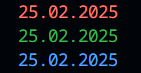

# Generators and Iterators 


## Generators
1. Random Number Generator 
```sh
import { floatGenerator } from "./generators/floatGenerator.js";
const generator = floatGenerator();
console.log(generator.next().value)
console.log(generator.next().value)
console.log(generator.next().value)
console.log(generator.next().value)
```
```
0.9184328820024408
0.9829442205263001
0.18786443801169694
0.13878725850773144
```

##

2. Round Robin Generator 
```sh
import { listGenerator } from "./generators/listGenerator.js";
const generator = listGenerator([1, 2, 3]);
console.log(generator.next().value)
console.log(generator.next().value)
console.log(generator.next().value)
console.log(generator.next().value)
```
```
1
2
3
1   
```

##

3. Fibonacci Sequence Generator
```sh
import { fibonacciGenerator } from "./generators/fibonacciGenerator.js";
const generator = fibonacciGenerator();
console.log(generator.next().value)
console.log(generator.next().value)
console.log(generator.next().value)
console.log(generator.next().value)
```
```
1
1
2
3  
```

##

4. Cyclic Date Generator
```sh
import { dateGenerator } from "./generators/dateGenerator.js";
const generator = dateGenerator();
console.log(generator.next().value)
console.log(generator.next().value)
console.log(generator.next().value)
console.log(generator.next().value)
```
```
Sunday
Monday
Tuesday
Wednesday
```

##

5. Incremental Counter Generator
```sh
import { incrementGenerator } from "./generators/incrementGenerator.js";
const generator = incrementGenerator(0);
console.log(generator.next().value)
console.log(generator.next().value)
console.log(generator.next().value)
console.log(generator.next().value)
```
```
1
2
3
4
```

##

6. Random String Generator
```sh
import { stringGenerator } from "./generators/stringGenerator.js";
const generator = stringGenerator(10);
console.log(generator.next().value)
console.log(generator.next().value)
console.log(generator.next().value)
console.log(generator.next().value)
```
```
p0(zfnt83z
7j9f36o8rm
w4)x0:ts8^
obh-v2j0p*
```

##

7. Color Cycle Generator
```sh
import { colorGenerator } from "./generators/colorGenerator.js";
const generator = colorGenerator();
console.log(generator.next().value)
console.log(generator.next().value)
console.log(generator.next().value)
console.log(generator.next().value)
```
```
red
green
blue
red
```

##

## Iterators
<b>iteratorFunction</b> - consume the iterator processing each value until timeout has elapsed.

Accepts:
 - An iterator (e.g., from the generator above)
 - A timeout duration (in seconds)
  
Processing tasks:
 - Print each value.
 - If the iterator yields numbers and print the total/avg on each iteration
 - For colors print current date and iteration in a specified color

### Example 1:
```sh
import { iteratorFunction } from "./iterators/iteratorFunction.js";
import { incrementGenerator } from "./generators/incrementGenerator.js";
const iterate = iteratorFunction(incrementGenerator(0), 1);
iterate.next();
iterate.next();
iterate.next();
```
Output:
```
Sum:  1  Avg:  1
Sum:  3  Avg:  1.5
Sum:  6  Avg:  2
```
### Example 2:
```sh
import { iteratorFunction } from "./iterators/iteratorFunction.js";
import { colorGenerator } from "./generators/colorGenerator.js";
const iterate = iteratorFunction(colorGenerator(), 1);
iterate.next();
iterate.next();
iterate.next();
```
Output:

